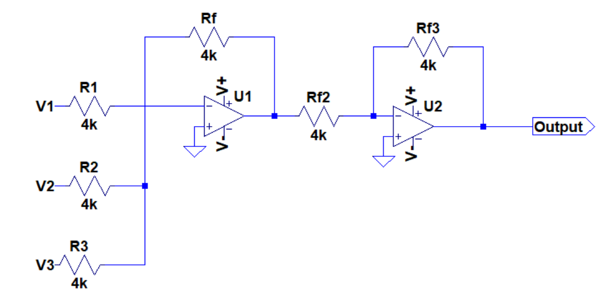
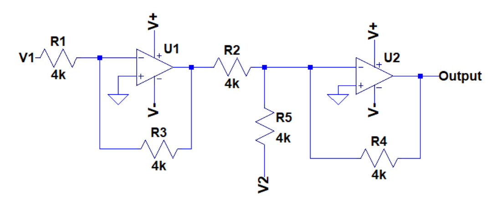
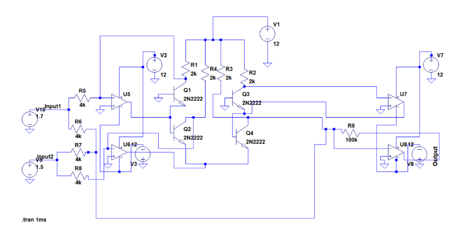
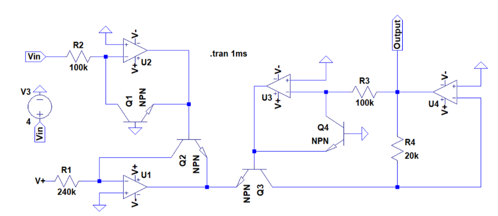

# Beyond Bits

## Project Overview
**Beyond Bits** is an electronics project that demonstrates the design and implementation of an **Analog Calculator** — a system that performs arithmetic operations using analog electronics rather than digital logic.  
It integrates IR sensors, operational amplifiers, and an Arduino-based control unit to create a working prototype of an analog computing device.

---

## Objective
This project explores how analog computation principles can be applied in modern electronics. Instead of using discrete digital logic gates, the Beyond Bits analog calculator relies on continuous voltage signals processed through operational amplifiers to execute arithmetic operations like:

- Addition  
- Subtraction  
- Multiplication  
- Square Root

The Arduino acts as the central controller, collecting data from the IR setup and managing the signal flow to the analog circuit.

---

## Components Used

| Component | Function |
|------------|-----------|
| Arduino Uno | Coordinates the IR input and controls the analog circuit |
| IR Sensors | Provide input values for the calculator |
| Operational Amplifiers (Op-Amps) | Perform mathematical operations in analog domain |
| Resistors | Set voltage levels and gain configurations for op-amps |
| Voltage Sources | Provide power to the analog components |

---

## Working Principle

1. **IR Setup** – Detects and provides input signals representing operands.  
2. **Arduino Control** – Reads sensor data, determines which operation to perform (via control pins), and directs the circuit accordingly.  
3. **Analog Computation** – The selected op-amp configuration executes the arithmetic operation using analog voltage manipulation.  
4. **Output Measurement** – The resulting analog voltage represents the computed value.

Each operation is mapped to a specific set of Arduino pin combinations:

| Operation | Pin Selection |
|------------|---------------|
| Addition | 00 |
| Subtraction | 01 |
| Multiplication | 10 |
| Square Root | 11 |

---

## LTspice Schematics

All circuit schematics for the operations are designed and tested using **LTspice**.  
You can view them collectively here:  
[LTspice Analog Calculator Circuits](https://1drv.ms/f/s!AjqtU5XouHO3yheM1FlWDB7gQKV-?e=wAPk0l)

### 1. Addition Circuit

### 2. Subtraction Circuit

### 3. Multiplication Circuit

### 4. Square Root Circuit

*(Place your images in a folder named `images/` inside the repository, or adjust the path as needed.)*

---

## Arduino Code

The complete control code for the project is available as:  
[`final_code.ino`](final_code.ino)

It handles:
- Input from the IR setup  
- Selection of arithmetic operation  
- Coordination of analog outputs  

---

## How to Run

### Hardware Setup
1. Connect IR sensors to Arduino input pins.  
2. Build the analog calculator circuit using op-amps as per the provided schematics.  
3. Link Arduino control pins to the circuit operation selectors.

### Software Setup
1. Open `final_code.ino` in Arduino IDE.  
2. Connect your Arduino board.  
3. Upload the code.

### Execution
1. Provide inputs via the IR setup.  
2. Observe analog output corresponding to the selected arithmetic operation.

---

## Documentation
Detailed circuit diagrams, theoretical explanations, and step-by-step descriptions are available in the full report:  
**Beyond Bits.pdf**

---

## Contributors
- Prachi Bindal
- Shreeya Gupta
- Mrinal Agrawal
- Shreya Raj
- Aradhya 

